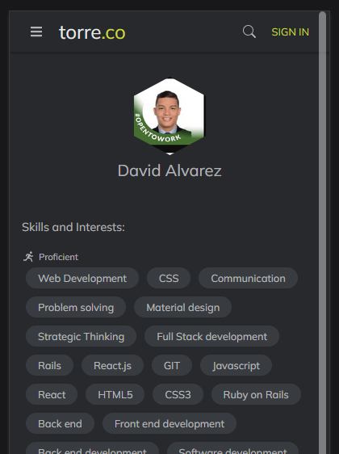

# User Skills Page

> An MVP(Minimum viable product) web page app that consumes an API to fetch users' data, login system, and display a user list of skills. This is the front end of a full-stack app, you can find the back end [here](https://github.com/petudeveloper/user-skills-backend).



- The application uses the [backend](https://github.com/petudeveloper/user-skills-backend) to do user authorization and authentication.
- After login, the rendered information comes from a fetch done to the resource `https://bio.torre.co/api/bios/davidalvarezmazzo`.

## Built With

- React

## Live Demo

[Live Demo Link](https://ecstatic-saha-5a0944.netlify.app)


## Getting Started

To get a local copy up and running follow these simple example steps.

### Prerequisites

- Node.js
- React

### Setup
```
git clone https://github.com/petudeveloper/user-skills.git
cd user-skills
```
### Install
```
npm install
```

### Usage
```
npm start
```

## Authors

👤 **David Alvarez**

- GitHub: [@petumazo](https://github.com/petudeveloper)
- Twitter: [@petudeveloper](https://twitter.com/petudeveloper)
- LinkedIn: [David Alvarez](https://www.linkedin.com/in/davidalvarezmazzo/)

## 🤝 Contributing

Contributions, issues, and feature requests are welcome!

Feel free to check the [issues page](../../issues/).

## Show your support

Give a ⭐️ if you like this project!

## Acknowledgments

- Hat tip to anyone whose code was used
- Inspiration
- etc

## 📝 License

This project is [MIT](./MIT.md) licensed.
